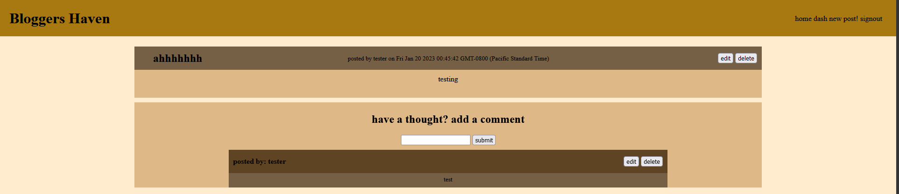
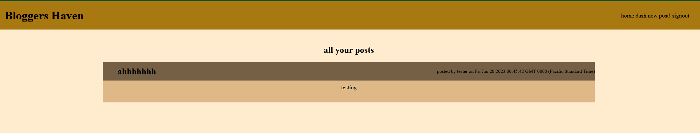
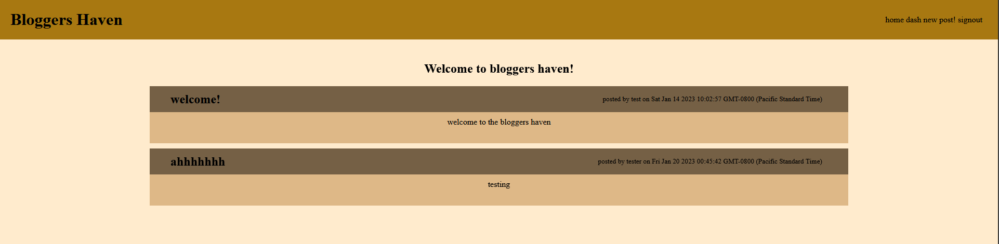

# bloggers-haven

## Description
this app lets you create blog posts and share them on a public field

## Installation
go the the website @:https://bloggers-haven.herokuapp.com/

## Usage
go to the website and create an account using the "signup/signin" and fill out the signup form aka the bottom 2 boxes and press the sign up button and you should be logged in once you are loggen in you will see a new post button on the top right of the screen press the button and you will be taken to a page with 2 text boxes labeled title and content to make a post just fill these boxes and press post congrats you now have a post! it should look something like this

you should be able to see the post and all of it's comments and theres also a box under the post that you can fill and write your own comment  
on the top right of both the comments and posts if you are the creator of them there should be an edit and delete button theat you can use to edit and delete your post once you are don press the dash button on the top right of the screen

and you should see all of the posts you have posted and like the homepage you can just press the post to look at the post and comments and if you made it you can modify it
if at any point you want to go to the homepage you can press the title on the topleft of the home button on the top right it should lead to the hompeage that looks like this

## Links
website: https://bloggers-haven.herokuapp.com/
